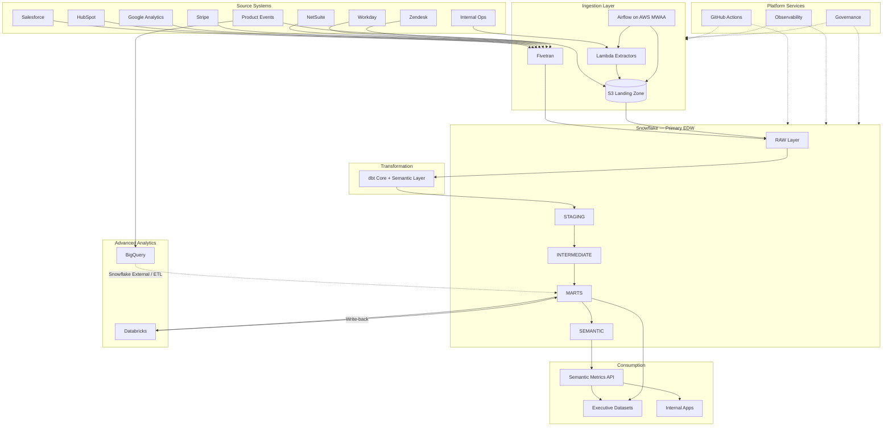

# Atlas Hub — Architecture Overview

## End-to-End Architecture



## Technology Selection Rationale

| Component | Selected | Alternatives Considered | Rationale |
|-----------|----------|-------------------------|-----------|
| EDW | Snowflake | Redshift, BigQuery-only | Best multi-cloud SaaS fit, RBAC/masking, separation of storage/compute, finance team familiarity |
| GCP Analytics | BigQuery | Snowflake only | Native GA4 export, petabyte-scale event scans, cost-effective for high-volume events |
| Ingestion (SaaS) | Fivetran | Airbyte, Stitch | Managed connectors, schema drift handling, SLA, lower ops burden at scale |
| Orchestration | Airflow (MWAA) | Dagster, Prefect | Mature AWS integration, Lambda/S3 patterns, team expertise |
| Transform | dbt | SQL-only, Dataform | Testing, docs, lineage, semantic layer, industry standard |
| ML | Databricks | SageMaker, Snowflake ML | Spark for feature engineering, MLflow, notebook → job promotion |
| Metrics API | FastAPI + dbt Semantic | Cube, proprietary BI semantic layers | Open, version-controlled metrics aligned with dbt definitions |

## Component Responsibilities

| Component | Owns | Does Not Own |
|-----------|------|--------------|
| Fivetran | SaaS → Snowflake RAW sync, connector health | Business logic, deduplication |
| Lambda | Custom REST extraction, enrichment APIs | Orchestration, scheduling |
| Airflow | Scheduling, dependencies, SLAs, backfills | Transformation logic |
| dbt | Staging → marts, tests, docs, semantic metrics | Orchestration, ingestion |
| Databricks | ML, segmentation, forecasting, heavy FE | Core KPI SQL |
| BigQuery | Event-level analytics, GA4 native | Financial reporting |
| Semantic API | Metric access, auth, caching | Metric definition (owned by dbt) |

## Medallion Flow (Snowflake)

```
RAW (Fivetran + S3) → STAGING (views) → INTERMEDIATE (tables) → MARTS (tables) → SEMANTIC (metrics)
```

## Physical Architecture

See [physical-architecture.md](physical-architecture.md).

## Data Flow Diagrams

See [data-flows.md](data-flows.md).

## Service Interaction

See [service-interactions.md](service-interactions.md).

## Data Modeling Layers

| Layer | Database.Schema Pattern | Materialization | Purpose |
|-------|-------------------------|-----------------|--------|
| Raw | `RAW_{ENV}.{SOURCE}` | Tables (Fivetran/Snowpipe) | Immutable source landing |
| Staging | `ANALYTICS_{ENV}.STG_{SOURCE}` | Views | Rename, cast, dedupe keys |
| Intermediate | `ANALYTICS_{ENV}.INT` | Tables/Views | Cross-source joins, SCD prep |
| Marts | `ANALYTICS_{ENV}.MART_{DOMAIN}` | Tables | Business-ready datasets |
| Semantic | dbt Semantic Layer | Metric definitions | Reusable KPIs |

## Environment Promotion

```
dev → staging → prod

- Snowflake DDL applied via SQL scripts in snowflake/
- dbt targets: dev (views), staging/prod (tables)
- Airflow variables per env; prod DAGs require approval
- Semantic API: staging validates, prod serves traffic
```

## Related Documents

- [Logical Architecture](logical-architecture.md)
- [Physical Architecture](physical-architecture.md)
- [Data Flows](data-flows.md)
- [Service Interactions](service-interactions.md)
- [ADRs](../production-readiness/adrs/)
