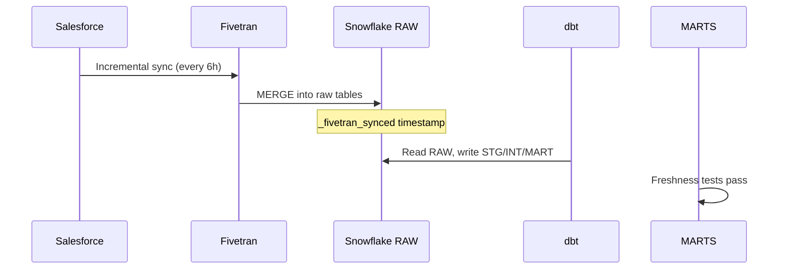
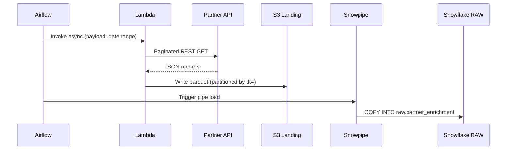
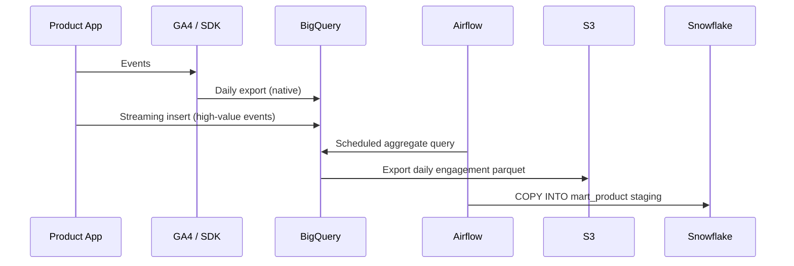
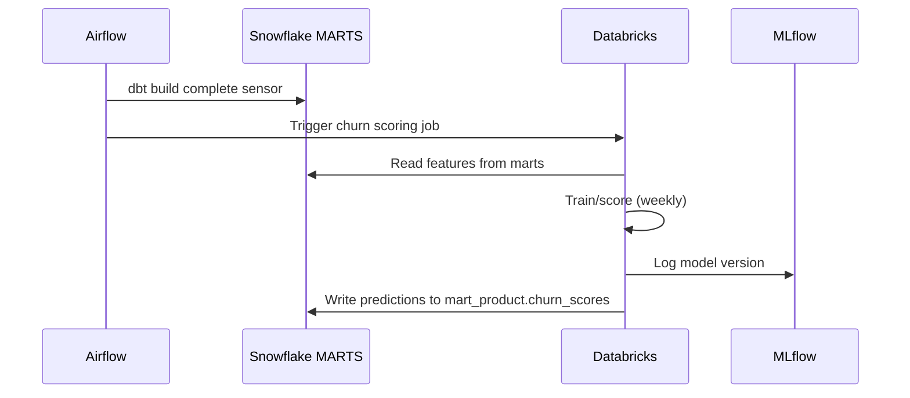
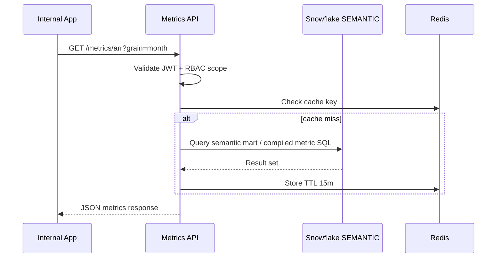

# Data Flow Diagrams

## Flow 1: SaaS → Snowflake (Fivetran)

## Flow 2: Custom API → S3 → Snowflake

## Flow 3: Product Events → BigQuery → Snowflake

## Flow 4: dbt → Databricks → Snowflake

## Flow 5: Semantic Metrics → API

## Daily Batch Schedule (Production)

| Time (ET) | Job |
|-----------|-----|
| 00:00 | Fivetran high-frequency connectors complete window |
| 02:00 | Airflow: custom extractions + S3 loads |
| 03:00 | Snowpipe ingest completion sensor |
| 04:00 | dbt build (staging → marts) |
| 05:00 | Databricks scoring (if ML day) |
| 05:30 | Semantic layer freshness tests |
| 06:00 | Tier 1 SLA deadline — exec datasets ready |
| 06:15 | Observability dashboard green / alert if not |
