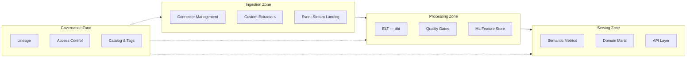
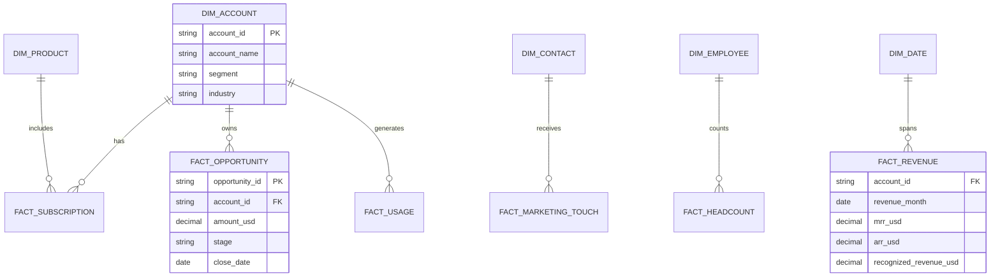

# Logical Architecture

## Domain-Driven Data Zones

## Entity Relationships (Conceptual)

## Layer Responsibilities

### Raw Layer
- Preserve source fidelity; no business rules
- Fivetran `_fivetran_*` metadata retained for audit
- S3 external tables for product events pre-BQ export

### Staging Layer
- 1:1 with raw tables where possible
- Standardize timestamps to UTC
- Surrogate keys not yet applied

### Intermediate Layer
- Account 360 spine (Salesforce account as golden key)
- SCD Type 2 for opportunities, employees, subscriptions
- Attribution path building (marketing touches)

### Mart Layer
- Denormalized for API and executive dataset consumption
- Domain-specific: finance, sales, marketing, product, hr
- Pre-computed KPIs where query cost is high

### Semantic Layer
- Versioned metric definitions (ARR, MRR, CAC, etc.)
- Consistent filters (e.g., exclude test accounts)
- Time grains: day, week, month, quarter

## Cross-Cutting Concerns

| Concern | Implementation |
|---------|----------------|
| Identity | `int_account_spine` maps SFDC ↔ Stripe ↔ HubSpot ↔ product |
| Test data exclusion | Global variable `exclude_test_account_ids` |
| Currency | USD normalization in `int_fx_rates` from NetSuite |
| Time | `dim_date` fiscal calendar aligned to Finance |
