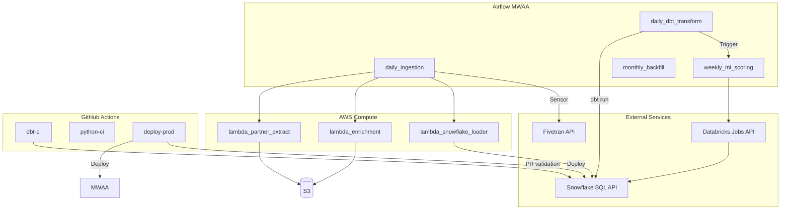

# Service Interaction Diagram



## Integration Matrix

| From | To | Protocol | Auth |
|------|-----|----------|------|
| Fivetran | Snowflake | JDBC (managed) | Key pair service account |
| Airflow | Lambda | AWS SDK invoke | IAM role |
| Airflow | Snowflake | Snowflake Operator | Secrets Manager |
| Airflow | dbt | BashOperator / Cosmos | Profiles via Airflow connection |
| Airflow | Databricks | DatabricksRunNowOperator | PAT in Secrets Manager |
| Lambda | External APIs | HTTPS | API keys in Secrets Manager |
| Metrics API | Snowflake | SQLAlchemy / connector | Service account + RBAC |
| GitHub Actions | Snowflake | dbt snowflake adapter | OIDC → AWS → Secrets |
| BigQuery | S3 | Export job | GCP SA + AWS role assumption |

## Failure Handling

| Integration | Retry | Dead Letter | Alert |
|-------------|-------|-------------|-------|
| Fivetran sync | Vendor-managed | Fivetran dashboard | PagerDuty if > 2h delay |
| Lambda extract | 3x exponential | S3 `errors/` prefix | SNS → Slack |
| Snowpipe | Auto retry | COPY history | Airflow sensor timeout |
| dbt run | 1 retry in CI; 0 in prod DAG | Failed model logs | PagerDuty Tier 1 |
| Databricks job | 2 retries | Job run history | Email ML on-call |

## API Contracts (Internal)

### Airflow → Lambda

```json
{
  "source": "partner_crm",
  "extract_date": "2026-05-29",
  "s3_bucket": "atlas-landing-prod",
  "s3_prefix": "partner_crm/dt=2026-05-29/"
}
```

### Metrics API Response

```json
{
  "metric": "arr",
  "grain": "month",
  "data": [
    {"period": "2026-04-01", "value": 12500000.00, "currency": "USD"},
    {"period": "2026-05-01", "value": 13100000.00, "currency": "USD"}
  ],
  "metadata": {
    "definition_version": "2.1.0",
    "generated_at": "2026-05-30T06:12:00Z"
  }
}
```
